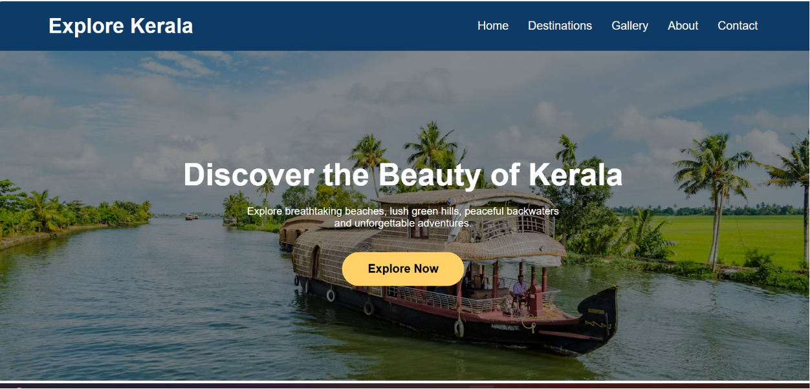
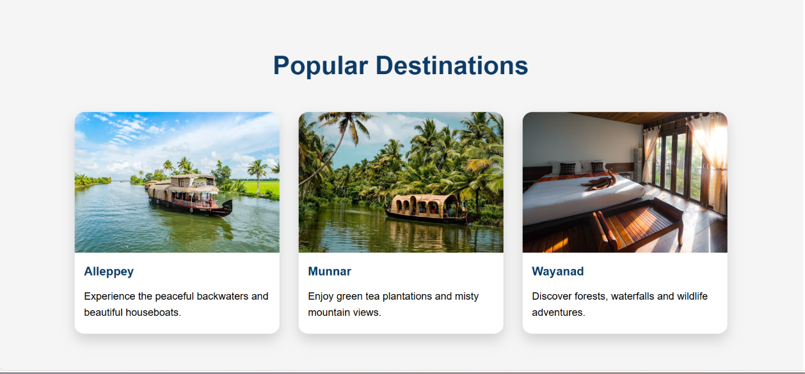
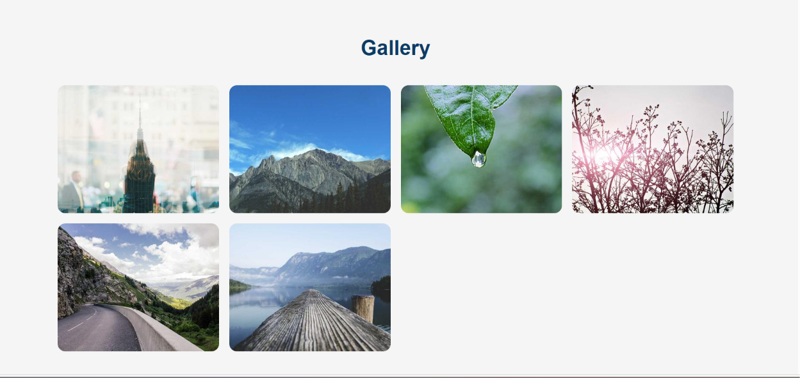
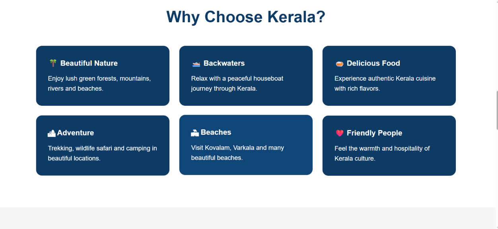
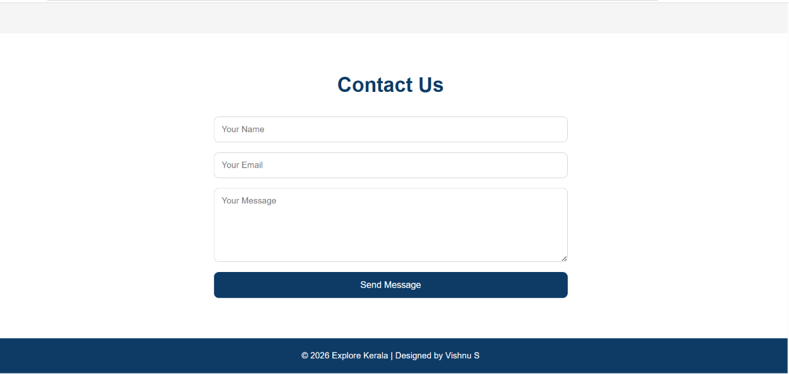
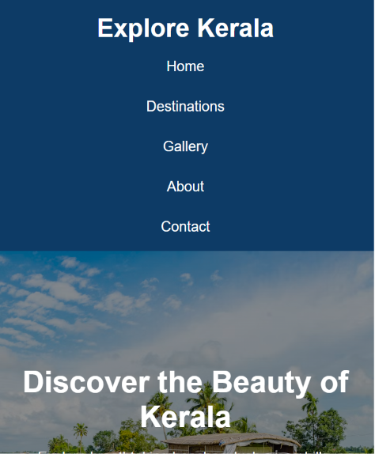

# 🌴 Explore Kerala

A responsive tourism website built using HTML5, CSS3, and JavaScript. This project showcases Kerala's famous tourist destinations, beautiful gallery, and a contact form with basic JavaScript validation.

## ✨ Features

- Responsive Navigation Bar
- Hero Section
- Popular Destinations
- Why Choose Kerala Section
- Image Gallery
- Contact Form with Validation
- Responsive Design
- Smooth Scrolling
- Clean and Modern UI

## 🛠️ Technologies Used

- HTML5
- CSS3
- JavaScript

## 📂 Project Structure

```
explore-kerala/
│
├── index.html
├── style.css
├── script.js
├── images/
└── README.md
```

## 🚀 How to Run

1. Clone the repository

```bash
git clone https://github.com/viishh0/explore-kerala.git
```

2. Open the project folder.

3. Open `index.html` in your browser.

## 📸 Screenshots

## 📸 Screenshots

### 🏠 Home Page



### 🏝️ Destinations



### 🖼️ Gallery



### ℹ️ About



### 📞 Contact



### 📱 Mobile View



## 👨‍💻 Author

**Vishnu S**

Computer Science Engineering Student  
Frontend Developer | MERN Stack Learner